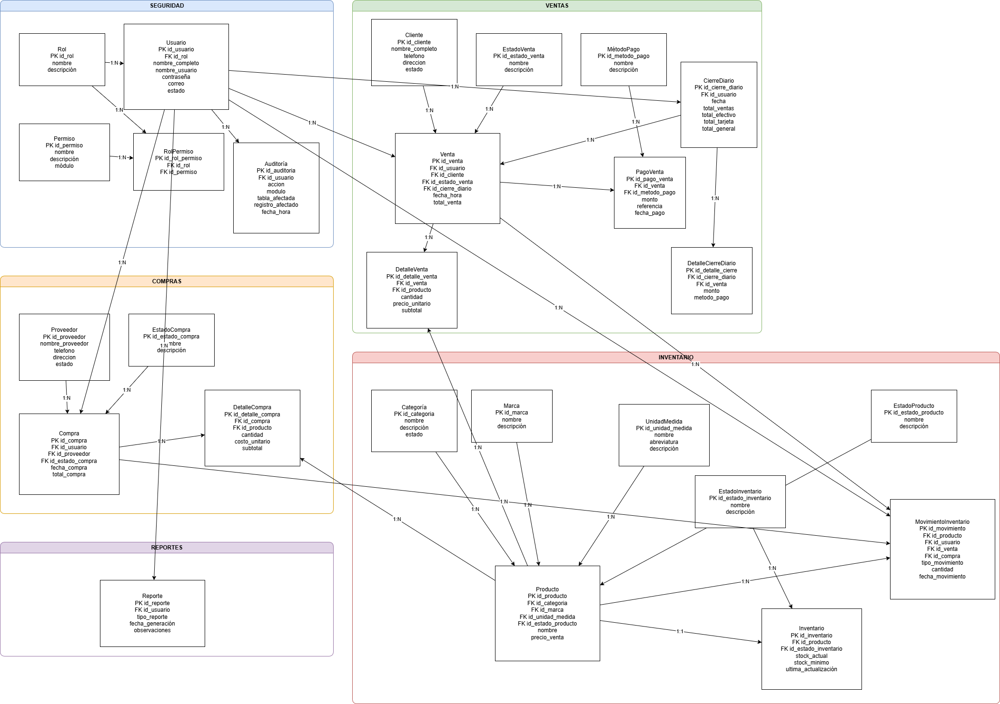
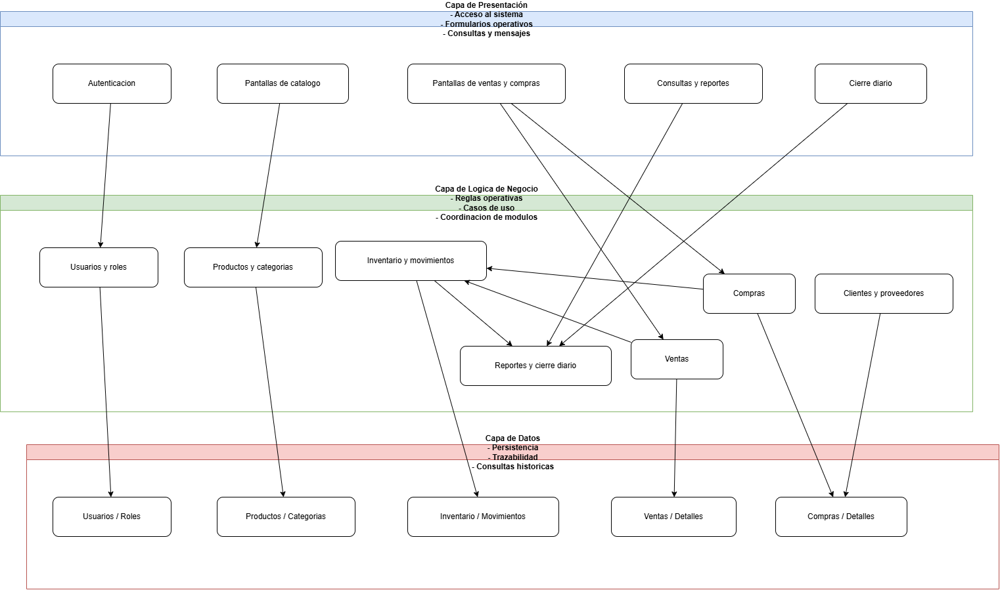
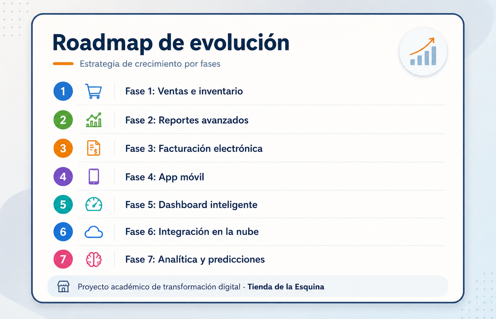

# Documento final maestro

## Capitulo 1. Introducción

### 1.1 Contexto

La Tienda de la Esquina representa un negocio pequeño con procesos operativos cotidianos que dependen de registros manuales. El proyecto documenta, de forma académica y profesional, la transformación de esa necesidad en una propuesta integral de análisis y diseño de sistemas.

### 1.2 Objetivo general

Consolidar una base documental completa que permita comprender el problema del negocio, modelar la solución y preparar una futura implementación con menor incertidumbre.

### 1.3 Alcance

El proyecto es documental y conceptual. No implementa backend, frontend funcional, APIs ni base de datos real.

## Capitulo 2. Análisis del negocio

### 2.1 Problema identificado

Los principales riesgos del negocio son:

- errores en el control de existencias;
- falta de trazabilidad sobre ventas y compras;
- poca visibilidad sobre productos agotados o vencidos;
- dificultad para realizar cierres diarios confiables.

### 2.2 Objetivos del negocio

- ordenar la operación de ventas;
- mantener inventario actualizado;
- mejorar control administrativo;
- facilitar decisiones de compra y reposición.

### 2.3 Stakeholders principales

| Stakeholder | Interés principal | Nivel de influencia |
|---|---|---|
| Don Pedro | Control total del negocio | Alto |
| Empleado | Rapidez y simplicidad operativa | Medio |
| Proveedor | Abastecimiento ordenado | Medio |
| Cliente | Atención rápida y confiable | Medio |

## Capitulo 3. Scrum

### 3.1 Enfoque metodológico

Scrum se utilizó como marco de trabajo incremental para estructurar entregables documentales y mantener trazabilidad entre fases.

### 3.2 Distribucion de sprints

| Sprint | Enfoque | Entregables clave |
|---|---|---|
| Sprint 1 | Análisis base | negocio, Scrum, stakeholders, reglas, requerimientos |
| Sprint 2 | Modelado funcional | historias, backlog, Casos de Uso, diagramas UML |
| Sprint 3 | Diseño estructural | modelo ER, arquitectura, trazabilidad |
| Sprint 4 | Cierre y propuesta | mockups, riesgos, QA, conclusiones, roadmap |

### 3.3 Beneficios del enfoque

- visibilidad del avance;
- orden de prioridades;
- coherencia entre backlog y entregables;
- control de alcance académico.

## Capitulo 4. Requerimientos

### 4.1 Requerimientos funcionales clave

| ID | Requerimiento | Prioridad |
|---|---|---|
| RF-01 | Registrar productos | Alta |
| RF-07 | Registrar entradas de inventario | Alta |
| RF-09 | Registrar ventas con varios productos | Alta |
| RF-11 | Validar disponibilidad antes de vender | Alta |
| RF-12 | Descontar inventario automaticamente | Alta |
| RF-14 | Consultar historial de ventas | Alta |
| RF-20 | Listar productos agotados | Alta |
| RF-25 | Generar resumen de ventas del día | Alta |
| RF-26 | Autenticar usuarios por rol | Media |
| RF-27 | Restringir cambios a usuarios autorizados | Alta |

### 4.2 Requerimientos no funcionales

| ID | Categoria | Enfoque |
|---|---|---|
| RNF-01 | Usabilidad | interfaz facil de aprender |
| RNF-03 | Confiabilidad | integridad ante errores |
| RNF-04 | Seguridad | control de autenticación |
| RNF-05 | Integridad | consistencia venta-inventario |
| RNF-06 | Trazabilidad | consulta histórica |
| RNF-10 | Mantenibilidad | facilidad de respaldo y orden |

### 4.3 Reglas de negocio críticas

- no vender sin stock;
- no registrar precios menores o iguales a cero;
- actualizar inventario después de ventas o compras;
- bloquear productos vencidos;
- restringir cambios de precio a usuarios autorizados.

## Capitulo 5. Historias de usuario

Las historias se organizaron segun valor de negocio y prioridad MoSCoW.

| Historia | Enfoque | Prioridad |
|---|---|---|
| HU-04 | Registrar venta | Must |
| HU-06 | Registrar entradas de inventario | Must |
| HU-08 | Consultar historial de ventas | Must |
| HU-15 | Identificar productos vencidos | Must |
| HU-18 | Ver resumen diario | Must |
| HU-20 | Autenticar usuarios por rol | Should |

La relación entre historias y requerimientos se valido mediante la matriz de trazabilidad.

## Capitulo 6. Casos de uso

### 6.1 Casos de uso principales

- CU-01 Iniciar sesión
- CU-02 Registrar producto
- CU-07 Registrar compra
- CU-09 Registrar venta
- CU-10 Consultar historial de ventas
- CU-11 Consultar reportes
- CU-12 Generar cierre diario
- CU-14 Gestionar inventario

### 6.2 Valor de modelado

Los Casos de Uso definen actores, precondiciones, flujos principales, flujos alternos y reglas relacionadas. Esto facilita traducir la necesidad de negocio en comportamiento esperado del sistema.

## Capitulo 7. Diagramas UML

### 7.1 Diagramas incluidos

- Casos de Uso generales y por dominio;
- actividades de venta, inventario y cierre diario;
- flujo general del sistema y de módulos.

### 7.2 Referencias visuales

Los diagramas UML se relacionan con requerimientos, Historias de Usuario y Casos de Uso, evitando contradicciones entre lo funcional y lo visual.

## Capitulo 8. Modelo entidad-relación

### 8.1 Entidades clave

- Producto
- Categoria
- Inventario
- MovimientoInventario
- Venta
- DetalleVenta
- Compra
- DetalleCompra
- Proveedor
- Cliente
- Usuario
- Rol
- CierreDiario

### 8.2 Referencia visual

El modelo base mantiene coherencia con los flujos de ventas, compras, ajustes y reportes.

## Capitulo 9. Arquitectura candidata

### 9.1 Módulos propuestos

- autenticación y usuarios;
- gestión de productos;
- gestión de inventario;
- gestión de compras;
- gestión de ventas;
- reportes;
- administración y cierre diario.

### 9.2 Criterios arquitectonicos

- modularidad;
- separación de responsabilidades;
- trazabilidad de operaciones;
- facilidad de crecimiento incremental.

### 9.3 Referencia visual

## Capitulo 10. Mockups

### 10.1 Pantallas principales

- login;
- dashboard;
- registrar venta;
- inventario;
- productos;
- clientes;
- proveedores;
- compras;
- reportes;
- cierre diario.

### 10.2 Funcion del prototipado

Los mockups permiten validar estructura de navegación, distribución de información y correspondencia con Casos de Uso antes de programar.

### 10.3 Referencias

- [Login](../mockups/html/01-login.html)
- [Dashboard](../mockups/html/02-dashboard.html)
- [Registrar venta](../mockups/html/03-registrar-venta.html)
- [Reportes](../mockups/html/09-reportes.html)
- [Cierre diario](../mockups/html/10-cierre-diario.html)

## Capitulo 11. Riesgos

### 11.1 Riesgos principales

- resistencia al cambio;
- inconsistencias entre ventas e inventario;
- crecimiento no controlado del alcance;
- falta de validación con usuarios reales;
- dependencia de procesos manuales durante la transicion.

### 11.2 Tratamiento

Se definieron acciones de mitigacion, responsables y prioridades en la matriz de riesgos.

## Capitulo 12. QA y validaciónes

### 12.1 Artefactos de calidad

- plan de pruebas;
- 20 casos de prueba;
- matriz de validación;
- checklist de calidad;
- revision técnica.

### 12.2 Resultado global

La validación documental confirma consistencia entre RF/RNF, historias, Casos de Uso, arquitectura, modelo ER, mockups y QA.

## Capitulo 13. Roadmap y propuesta futura

### 13.1 Evolución futura

| Fase | Enfoque |
|---|---|
| 1 | ventas e inventario |
| 2 | reportes avanzados |
| 3 | facturación electrónica |
| 4 | aplicación móvil |
| 5 | dashboard inteligente |
| 6 | integración nube |
| 7 | analítica y predicciones |

### 13.2 Referencia visual

La propuesta futura posiciona el proyecto como una ruta de transformación digital incremental y viable.

## Capitulo 14. Conclusiones

El proyecto demuestra que un problema cotidiano de negocio puede convertirse en un entregable de ingeniería de software bien estructurado cuando existe disciplina en análisis, modelado, trazabilidad y validación.
